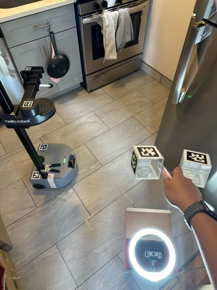

# Data Collection for Stretch


Our data collection system is based on a low-cost teleoperation framework called [Dex Teleop](https://github.com/hello-robot/stretch_dex_teleop). You use a webcam to track a unique tool with AR markers, and the robot follows the tool. This system is designed to be easy to use and it allows us to collect high-quality data for training robot learning algorithms.

To start with, we recommend you using our [Stretch Dexterous Teleop Kit](https://hello-robot.com/stretch-dex-teleop-kit). To collect data, connect the logitech C930 camera with the machine where you want to run data collection script and save the collected data. 

## Prerequisites:

Follow the [instructions](../README.md#Installation) for installation of `stretch_ai` with Python 3.10 for both PC and robot.

Make sure you have the optional dependencies installed for Dex Teleop:

```bash
python -m pip install webcam mediapipe
```

### On PC:

- Linux instructions: if using a Linux PC, run `install_dex_teleop.sh` to update `udev` rules
  
  ```bash
  cd /path/to/stretch_ai/scripts
  ./install_dex_teleop.sh
  ```

- [Camera calibration](https://github.com/hello-robot/stretch_dex_teleop?tab=readme-ov-file#generate-specialized-urdfs) for dex teleop

We recommend running all data collection commands without using docker, but we also realize that Dex teleop scripts might be unstable on some machine, it is also a good idea to use the docker for it. You should first make sure you understand how we use [Docker](./docker.md) in this repo. Then, follow these commands to open docker terminal. 

To build docker image, run
```bash
./docker/build-dex-teleop-docker.sh
```

To run terminal command in your docker image. The `src` argument allows you to link the stretch ai in your PC with the stretch ai folder in the docker image. So the data you collected will automatically appear on your local machine after data collection finishes.
```bash
./scripts/run_stretch_ai_dex_teleop.sh --src $STRETCH_AI_FOLDER
```

### On Robot:

*First, generate specialized URDFs.* These are special versions of the robot model that are needed to run the dex teleop app. You generate them by running:

```bash
cd stretch_ai
python3 src/stretch/app/dex_teleop/prepare_specialized_urdfs.py
```

*Then, move URDFs from robot to PC.* URDFs should now have been generated into the `stretch_ai` folder on the robot:

```bash
stretch_base_rotation_ik_with_fixed_wrist.urdf
stretch_base_rotation_ik.urdf
stretch_base_translation_ik_with_fixed_wrist.urdf
stretch_base_translation_ik.urdf
```

Using your preferred method, move the following URDF files into the `stretch_ai` folder on your PC (or wherever you intend to run the dex teleop app from).

## Quickstart: Record Some Data

### On the robot run:

```bash
ros2 launch stretch_ros2_bridge server.launch.py
```

### On the PC run:

Click this thumbnail to see data collection teleop in action:

[](https://www.youtube.com/watch?v=ZQQWOkSkw5o)

```bash
python -m stretch.app.dex_teleop.ros2_leader -i $ROBOT_IP --task-name default_task
```

A GUI displaying RGB and depth feeds from both cameras will now pop up. All commands are sent by pressing the keyboard with this GUI selected as the active window.

You can now record demonstrations by pressing `spacebar` to start and stop recording. See [Recording demonstrations with Dex Teleop](data_collection.md#recording-demonstrations-with-dex-teleop) for more details. After a trial is over, press y/n to record if it was successful.

## Recording demonstrations with Dex Teleop

### Launch dex teleop follower on robot:

```bash
ros2 launch stretch_ros2_bridge server.launch.py
```

### Launch dex teleop leader on PC:

Currently supported teleop modes include: `base_x`, `rotary_base`, and `stationary_base`.
Launch this command from the directory where URDFs are stored (default is root of stretch_ai)

If you have already ran an app with `--robot-ip` flag, such as the `view_images` test app, you can omit the flag in subsequent runs.

```bash
# The -s flag enables png images to be saved in addition to videos, which is faster for model training if training is CPU bound (no video decoding)

TASK_NAME=<name-of-task>
python3 -m stretch.app.dex_teleop.ros2_leader --robot_ip $ROBOT_IP --task-name $TASK_NAME --teleop-mode <teleop-mode> --clutch
```

For example:

```bash
python3 -m stretch.app.dex_teleop.ros2_leader --task-name default_task --teleop-mode base_x --clutch
```

The optional `--clutch` flag enables the clutch. While your hand is over the dex teleop webcam, the robot will not move. This makes it easier to operate the robot and to collect data.

#### Teleop Modes

There are three teleop modes available:

- `base_x`: Allows for translation of the robot base in the x direction
- `rotary_base`: Allows for rotation of the robot base
- `stationary_base`: Allows for no movement of the robot base

The default is `base_x`. So, if you want to use `base_x`, you can omit the `--teleop-mode` flag:

```bash
python3 -m stretch.app.dex_teleop.ros2_leader --task-name default_task --save-images
```

### Record episodes

- Press `spacebar` to start recording a demonstration, press `spacebar` again to end demonstration
- Demonstrations will be stored in stretch_ai/data/`name-of-task`/default_user/default_env

## Tips for collecting effective demonstrations

### 1. Task direction alignment

Align the dex teleop webcam so that the `top of the webcam` is facing the same direction as the direction of `arm extension`. Also, in order to have a better view it is recommended to not have the dex teleop setup directly behind the robot, and instead be placed at a sideways displacement.

### 2. Taping for reference

For use in downstream LfD training, it is important to consider dataset distribution when collecting demonstrations. The policy is able to handle small offsets in starting configuration if such variation is also demonstrated in the training data.

Therefore, it can be useful to tape out a reference position as a basis for varying starting positions you want to introduce in the dataset.

### 3. Episode quality

Episodes should reflect the way you want the robot to complete the task. Your first couple of runs doing the task will not be consistent, but will improve as you learn the feel for the teleoperation. It is recommended to start collecting demonstrations used for training only after sufficient practice with the task.

| Task direction alignment             | Taping for positional reference   |
|:------------------------------------:|:---------------------------------:|
|  |  |
