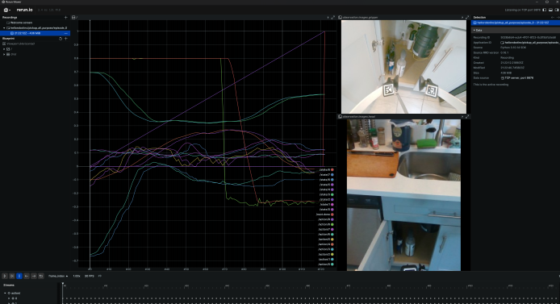
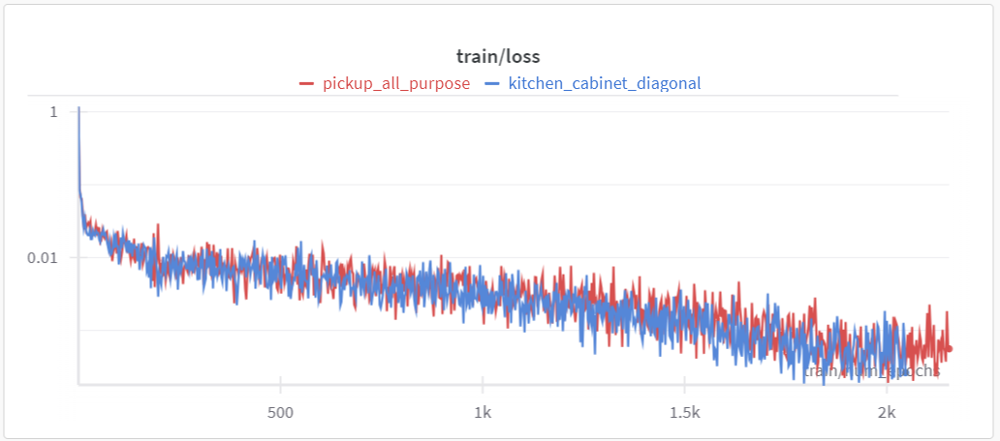

# Learning from Demonstration (LfD)

## Prerequisites:

1. Follow [instructions](../README.md#advanced-installation) for advanced installation of stretch_ai with Python 3.10

1. Install Hello-Robot's fork of HuggingFace LeRobot

   ```bash
   # Install in same conda environment as stretch_ai
   conda activate stretch_ai

   git clone https://github.com/hello-robot/lerobot
   cd lerobot

   # Support for Stretch is currently implemented on this branch
   git switch stretch-act

   # Editable install makes editing configs useful, though configs can also be specified via cli
   pip install -e .
   ```

Our LfD code is a [fork of LeRobot](https://github.com/hello-robot/lerobot). The original LeRobot repo can be found [here](https://github.com/huggingface/lerobot).

## Overview of LfD process

1. [Collect demonstration dataset with dex teleop](data_collection.md) (`50 episodes`)
1. [Format dataset and push to HuggingFace Hub](#format-data-and-push-to-huggingface-repo)
1. [Train policy](#train-a-policy) (`1000 epochs`)
1. [Load and evaluate policy](#evaluating-a-policy)
1. [Integrate as skill in a long horizon task](#integrating-a-skill-in-a-long-horizon-task-example)

## Format data and push to huggingface repo

### [Authenticate with huggingface-cli](https://huggingface.co/docs/huggingface_hub/en/guides/cli)

### Optional: login to weights and biases (wandb)

Use the [weights and biases CLI](https://docs.wandb.ai/ref/cli/wandb-login) to login:

```bash
wandb login
```

You will then be able to track progress on training runs with [wandb](https://wandb.ai/).

### Process and push demonstration folder to HuggingFace repo

```bash
# --raw-dir:  where the episodes for this task are stored
# --repo-id: Name of huggingface dataset, consists of your ID and the dataset name separated by a `/`
# --local-dir: where a local copy of the final huggingface dataset will be stored, last two layers of local_dir should be in same format as the repo-id
# --video: If true, dataset will only contain videos and no images
# --fps: FPS of demonstrations

python ./lerobot/scripts/push_dataset_to_hub.py \
--raw-dir ./path-to-raw-dir \
--repo-id <huggingface-id>/<your-dataset-name> \
--raw-format dobbe \
--local-dir ./path-to-local-dataset-folder/<huggingface-id>/<your-dataset-name> \
--video 0 \
--fps 6
```

### Sample command assuming following folder structure:

```
my_workspace
├── stretch_ai
├── lerobot
└── data/
   ├── my-huggingface-id/
   │   └── my-dataset
   └── default_task/
       └── default_user/
           └── default_env/
               ├── episode_1_folder
               ├── episode_2_folder
               └── episode_3_folder
```

```bash
# Assuming cwd is my_workspace/lerobot
python ./lerobot/scripts/push_dataset_to_hub.py \
--raw-dir ../data/default_task/default_user/default_env \
--repo-id my-huggingface-id/my-dataset \
--raw-format dobbe \
--local-dir ../data/my-huggingface-id/my-dataset \
--video 0
--fps 6
```

### Visualizing dataset with Rerun.io (Optional)



```bash
# Sample command
python ./lerobot/scripts/visualize_dataset.py --repo-id my-huggingface-id/my-dataset --episode-index 0 --root ../data/default_task/default_user
```

```bash
# Specify root if you wish to use local copy of the dataset, else dataset will be pulled from web
# --repo-id: Huggingface dataset repo
# --episode-index: Which episode to visualize
# --root: Where the local copy of the huggingface dataset is stored (e.g. local-dir in the previous step, but without specific folder )
python ./lerobot/scripts/visualize_dataset.py \
--repo-id hellorobotinc/<your-dataset-name> \
--episode-index <episode-idx> \
--root ../data/default_task/default_user
```

## Train a policy

Policy config files are located in `./lerobot/configs/policy`. Env config files are located in `./lerobot/configs/env`

Available policy configs for Stretch:

- `stretch_diffusion` - default training configs for [Diffusion Policy](https://arxiv.org/abs/2303.04137v4)
- `stretch_diffusion_depth` - default training configs for [Diffusion Policy](https://arxiv.org/abs/2303.04137v4) with depth included as input
- `stretch_act_real` - default training configs for [ACT](https://arxiv.org/abs/2304.13705)
- `stretch_vqbet` - default training configs for [VQ-BeT](https://arxiv.org/abs/2403.03181)

Available env configs for Stretch:

- `stretch_real` - Standard 9 dim state space and (9+1) dim action space for Stretch
  - state: (x, y, theta, lift, arm, roll, pitch, yaw, gripper)
  - action: (x, y, theta, lift, arm, roll, pitch, yaw, gripper, progress)

Training configs defined in the policy yaml file can be overridden in CLI.
If the config looks like below:

```yaml
training:
  learning_rate: 0.001
```

At runtime we can override this by adding the snippet below. For more details see [Hydra docs](https://hydra.cc/docs/intro/) and [LeRobot](https://github.com/huggingface/lerobot?tab=readme-ov-file#train-your-own-policy).

```bash
training.learning_rate=0.00001
```

Like training any other model with a GPU, try to adjust batch size to maximally utilize GPU vRAM.

Sample training command:

```bash
python3 lerobot/scripts/train.py \
policy=stretch_diffusion \
env=stretch_real \
wandb.enable=true \
training.batch_size=64 \
training.num_workers=16 \
dataset_repo_id=<huggingface-id>/<your-dataset-name>  \
wandb.project=<wandb-project-name>
```

For example:

```bash
python3 lerobot/scripts/train.py \
policy=stretch_diffusion \
env=stretch_real \
wandb.enable=true \
wandb.project=diffusion_test_project \
training.batch_size=64 \
training.num_workers=16 \
dataset_repo_id=hellorobotinc/kitchen_cabinet_diagonal
wandb.project=diffusion-kitchen-diagonal
```

You can also set `dataset_repo_id` and `wandb.project` in the policy config file to avoid specifying it in the CLI.

### Sample loss curve for "two different tasks" trained with the same parameters

This shows that even for different tasks, loss curves should look similar

- `num_episodes` = 50
- policy=stretch_diffusion
- env=stretch_real
- Y-axis is `loss` in log scale
- X-axis is `num_epochs`, from experience 1000 epochs is enough for good performance
- Training took ~19 hours for 2000 epochs on RTX 4090
- [Full run available here](https://wandb.ai/jensenhuang2/diffusion-kitchen-diagonal?nw=nwuserjensenhuang2)



## Evaluating a policy

### On Robot:

```bash
ros2 launch stretch_ros2_bridge server.launch.py
```

### On PC:

Specify the policy name of the weights provided:

- Available policies: `diffusion`,`diffusion_depth`,`act`,`vqbet`

Specify the teleop mode according to the teleop mode used to train the policy

- Available teleop modes: `base_x`,`stationary_base`,`old_stationary_base`

```bash
python3 -m stretch.app.lfd.ros2_lfd_leader \
--robot_ip $ROBOT_IP \
--policy_name <name-of-policy> \
--policy_path <path-to-weights-folder> \
--teleop-mode <teleop-mode>
```

Sample command:

```bash
python3 -m stretch.app.lfd.ros2_lfd_leader \
--robot_ip $ROBOT_IP \
--policy_path lerobot/outputs/train/2024-07-28/17-34-36_stretch_real_diffusion_default/checkpoints/100000/pretrained_model \
--policy_name diffusion \
--teleop-mode base_x
```

The default teleop mode is `base_x` which is the most common teleop mode used for training; you can omit the `--teleop-mode` argument if you used this mode. As with other apps, `--robot_ip` is also saved. A more common command would look like:

```bash
python3 -m stretch.app.lfd.ros2_lfd_leader \
--policy_path lerobot/outputs/train/2024-07-28/17-34-36_stretch_real_diffusion_default/checkpoints/100000/pretrained_model \
--policy_name diffusion
```

Where `--policy_path` is the path to the weights folder and `--policy_name` is the name of the policy used to train the weights, e.g. `diffusion` for Diffusion Policy.

#### Troubleshooting

##### Repo id must be in the form 'repo_name' or 'namespace/repo_name'

This error can be a bit hard to interpret, and manifests like this:

```
huggingface_hub.errors.HFValidationError: Repo id must be in the form 'repo_name' or 'namespace/repo_name': 'src/lerobot/outputs/train/2024-08-28/16-22-19_stretch_real_diffusion_default/checkpoints/030000/pretrained_model'. Use `repo_type` argument if needed.
```

This means that the `--policy_path` argument is not pointing to the correct folder. Make sure that the path is correct and that the folder contains the weights.

### Skill in action:

[](https://www.youtube.com/watch?v=FeASJ-EmCqQ)

## Integrating a skill in a long horizon task (example)

`stretch.app.ovmm_lfd_demo` demonstrates an implementation of multiple skills integrated in a long horizon task generated by a code-as-policy framework with [Gemma2b client](../src/stretch/llms/gemma_client.py). The current implementation is environment specific (e.g. it will not work in your home), but provides an example for how LfD skills can be integrated.

Details for the two trained skills can be found on our [Huggingface page](https://huggingface.co/hellorobotinc)

Locations in this demo are pre-saved as { name: (x,y,theta) } pairs based on an earlier mapping run. Below is the full output from the run based on the prompt:

`Can you bring me the bottle that's inside the cabinet? You might need to open the cabinet first, also do not use detections`:

````
Enter a long horizon task: Can you bring me the bottle that's inside the cabinet? You might need to open the cabinet first, also do not use detections
Generated plan:
```python
def execute_task(go_to, pick, place, say, open_cabinet, close_cabinet, wave, get_detections):
    if go_to("cabinet"):
        if open_cabinet():
            if pick("bottle"):
                if go_to("user"):
                    say("Here is the bottle.")
                else:
                    say("I am sorry, I could not reach you")
            else:
                say("I am sorry, I could not pick the bottle")
        else:
            say("I am sorry, I could not open the cabinet")
    else:
        say("I am sorry, I could not go to the cabinet")
```
Proceed with plan? [y/n]: y
RES:  True
- Going to cabinet
- 0 [4.99106818e-04 1.00275503e-06 3.12203060e-03]
- 1 [4.99106818e-04 1.00275503e-06 4.52567717e-01]
- 2 [0.70500136 0.34254823 0.45256772]
- 3 [0.70500136 0.34254823 0.85715184]
==================== Waiting for -1 at goal ====================
Loading weights from local directory
/root/miniforge3/envs/stretch_ai/lib/python3.10/site-packages/torch/nn/modules/conv.py:456: UserWarning: Applied workaround for CuDNN issue, install nvrtc.so (Triggered internally at /opt/conda/conda-bld/pytorch_1702400366987/work/aten/src/ATen/native/cudnn/Conv_v8.cpp:80.)
  return F.conv2d(input, weight, bias, self.stride,
[2024-08-15T22:05:00Z INFO  re_ws_comms::server] Memory limit (954 MiB) exceeded. Dropping old log messages from the server. Clients connecting after this will not see the full history.
[LEADER] Stopping policy execution
RES:  True
- Going to bottle
- 0 [0.81259126 0.42235697 0.77612764]
- 1 [0.81259126 0.42235697 1.46725734]
- 2 [0.80167704 0.3173223  1.46725734]
- 3 [0.80167704 0.3173223  4.60884999]
- 4 [0.79134164 0.21785784 4.60884999]
- 5 [0.79134164 0.21785784 4.60884999]
- 6 [0.78100623 0.11839338 4.60884999]
- 7 [0.78100623 0.11839338 4.60884999]
- 8 [ 0.75       -0.18        4.60884999]
- 9 [ 0.75       -0.18        1.57324166]
==================== Waiting for -1 at goal ====================
Loading weights from local directory
[LEADER] Stopping policy execution
RES:  True
- Going to user
- 0 [ 0.79606889 -0.09356569  1.6107392 ]
- 1 [ 0.79606889 -0.09356569  3.02459477]
- 2 [0.         0.         3.02459477]
- 3 [0.   0.   1.57]
==================== Waiting for -1 at goal ====================
[STRETCH SAYS]:  Here is the bottle.
````

[](https://www.youtube.com/watch?v=9w8o-dPGd58)
