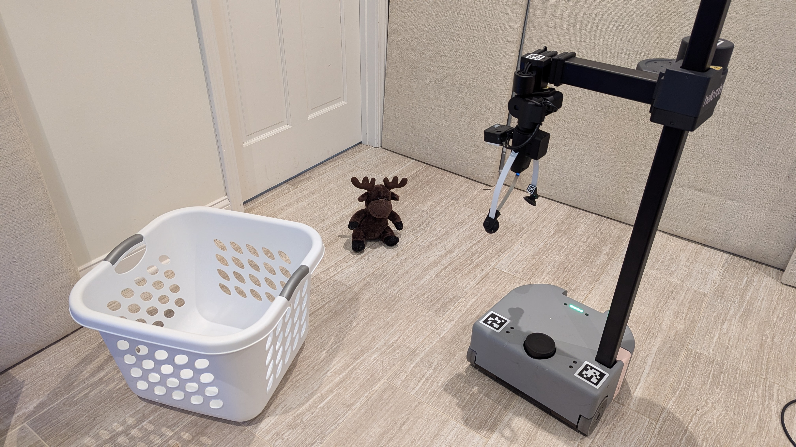

# The Stretch AI Agent

Stretch AI contains the tools to talk to your robot and have it perform tasks like exploration, mapping, and pick-and-place. In this document, we'll walk through what the AI agent is, how it works, and how to test out different components of the LLM.

[](https://www.youtube.com/watch?v=oO9qRkiuiAQ)

[Above](https://www.youtube.com/watch?v=oO9qRkiuiAQ): example of the AI agent being used with the voice command and the open-source [Qwen2.5 LLM](https://huggingface.co/Qwen). The specific commands used in the video are:
```
python -m stretch.app.ai_pickup --use_llm --use_voice
```

## Running the AI Agent

The entry point to the AI demo is the `ai_pickup` script:

```bash
python -m stretch.app.ai_pickup
```

When you run the `ai_pickup` demo, Stretch will attempt to pick up an object from the floor and place it inside a nearby receptacle on the floor. You will use words to describe the object and the receptacle that you'd like Stretch to use.

While attempting to perform this task, Stretch will speak to tell you what it is doing. So, it is a good idea to make sure that you have the speaker volume up on your robot. Both the physical knob on Stretch's head and the volume settings on Stretch's computer should be set so that you can hear what Stretch says.

Now, on your GPU computer, run the following commands in the Docker container that you started with the script above.

You need to let the GPU computer know the IP address (#.#.#.#) for your Stretch robot.

```bash
./scripts/set_robot_ip.sh #.#.#.#
```

*Please note that it's important that your GPU computer and your Stretch robot be able to communicate via the following ports 4401, 4402, 4403, and 4404. If you're using a firewall, you'll need to open these ports.*

Next, run the application on your GPU computer:

It will first spend time downloading various models that it depends on. Once the program starts, you will be able to bring up a [Rerun-based GUI](https://rerun.io/) in your web browser.


Then, in the terminal, it will ask you to specify an object and a receptacle. For example, in the example pictured below, the user provided the following descriptions for the object and the receptacle.

```
Enter the target object: brown moose toy
Enter the target receptacle: white laundry basket 
```



At Hello Robot, people have successfully commanded the robot to pick up a variety of objects from the floor and place them in nearby containers, such as baskets and boxes.

### What is the AI Agent?

When you run the `ai_pickup` command, it will create a [Pickup Executor](../src/stretch/agent/task/pickup/pickup_executor.py) object, which parses instructions from either an LLM or from a handful of templates and uses them to create a reactive task plan for the robot to execute. When you use this with the `--use_llm` flag -- which is recommended -- it will instantiate one of a number of LLM clients to generate the instructions. The LLM clients are defined in the [llm_agent.py](../src/stretch/agent/llm/__init__.py) file and are:
  - `qwen25` and variants: the Qwen2.5 model from Tencent; a permissively-licensed model. The default is `qwen25-3B-Instruct`.
  - `openai`: the OpenAI GPT-4o-mini model; a proprietary model accessed through the OpenAI API.
  - `gemma2b`: the Gemma2b model from Google, accessed via Hugging Face's model hub.

We recommend `qwen25-3B-Instruct` or `gemma2b` if running locally on a powerful machine (e.g. a computer with an NVIDIA 4090 or similar), and `openai` if you have access to the OpenAI API.

For example if you want to test with Gemma 2b, you can run:
```bash
python -m stretch.app.ai_pickup --use_llm --llm gemma2b
```

#### Using OpenAI Models with Stretch AI

To use an OpenAI model, first create an OpenAI API KEY by following the [OpenAI quickstart instructions](https://platform.openai.com/quickstart). Then, set the `OPENAI_API_KEY` environment variable to your API key. You can do this by adding the following line to your `~/.bashrc` or `~/.bash_profile` file:

```bash
export OPENAI_API_KEY="your_api_key_here"
```

Then, restart your terminal or run `source ~/.bashrc` or `source ~/.bash_profile` to apply the changes.

You can specify that you want to use the OpenAI model by passing the `--llm openai` flag to the `ai_pickup` command:
```bash
python -m stretch.app.ai_pickup --use_llm --llm openai
```

### Testing the LLM Agent

You can use an LLM to provide free-form text input to the pick and place demo with the `--use_llm` command line argument.

Running the following command will first download an open LLM model. Currently, the default model is [Qwen2.5-3B-Instruct](https://huggingface.co/Qwen/Qwen2.5-3B-Instruct). Running this command downloads ~10GB of data. Using an ethernet cable instead of Wifi is recommended.

```bash
python -m stretch.app.ai_pickup --use_llm
```

Once it's ready, you should see the prompt `You:` after which you can write your text request. Pressing the `Enter` key on your keyboard will provide your request to the robot.

For example, the following requests have been successful for other users.

```
You: pick up the toy chicken and put it in the white laundry basket
```

```
You: Find a toy chicken
```

Currently, the prompt used by the LLM encourages the robot to both pick and place, so you may find that a primitive request results in the full demonstration task.

You can find the prompt used by the LLM at the following location. When running your Docker image in the development mode or running *stretch-ai* from source, you can modify this file to see how it changes the robot's behavior.

[./../src/stretch/llms/prompts/pickup_prompt.py](../src/stretch/llms/prompts/pickup_prompt.py)

## Agent Architecture

The entry point into the LLM Agent is the [ai_pickup.py](../src/stretch/app/ai_pickup.py) file. This file creates an instance of the [PickupExecutor](../src/stretch/agent/task/pickup/pickup_executor.py) class, which is responsible for parsing the instructions from the LLM and creating a task plan for the robot to execute.

In addition, if you ruin it with the `--use_llm` flag, it creates a chat wrapper:
```python
if use_llm:
	llm_client = get_llm_client(llm, prompt=prompt)
        chat_wrapper = LLMChatWrapper(llm_client, prompt=prompt, voice=use_voice)
```

This will create an LLM client (for example, the [OpenAI client](../src/stretch/llms/openai_client.py)), and provide it a [prompt](../src/stretch/llms/prompts). The prompt used in the LLM Agent demo is the [pickup_prompt.py](../src/stretch/llms/prompts/pickup_prompt.py).

Take a look at how the prompt starts out:
> You are a friendly, helpful robot named Stretch. You are always helpful, and answer questions concisely. You will never harm a human or suggest harm.
> 
> When prompted, you will respond using these actions:
> - pickup(object_name)  # object_name is the name of the object to pick up
> - explore(int)  # explore the environment for a certain number of steps
> - place(location_name)  # location_name is the name of the receptacle to place object in
> - say(text)  # say something to the user
> - wave()  # wave at a person
> - nod_head() # nod your head
> - shake_head() # shake your head
> - avert_gaze() # avert your gaze
> - find(object_name)  # find the object or location by exploring
> - go_home()  # navigate back to where you started
> - quit()  # end the conversation

This lists the different functions that the LLM agent can use to interact with the world. If you wanted to add your own functions to this list, you would start by adding them here. You would then add them to the `parse_command` function in the [PickupPrompt](../src/stretch/llms/prompts/pickup_prompt.py) class, and add the appropriate logic handling the function call to the [PickupExecutor](../src/stretch/agent/task/pickup/pickup_executor.py) class.

### Testing Individual Components

#### Mapping and Exploration

You can test the mapping capabilities of the robot by running the following command:

```bash
python -m stretch.app.mapping
```

This will start the robot in a mapping mode, where it will explore the environment and build a map of the room. You should be able to see this map in Rerun.

If your robot is 

#### Grasping

The AI demo operates on detected images of objects, like these:

| Object Image | Receptacle Image |
|--------------|------------------|
| [](object.png) | [](receptacle.png) |

You may want to test the robot's grasping capabilities by running the following command:

```bash
python -m stretch.app.grasp_object --target_object "stuffed toy leopard"
```

This will have the robot attempt to grasp the object described in the `--target_object` argument.


[](https://www.youtube.com/watch?v=gjgVwcyPNdY)

To test the grasping app, place an object directly in front of the robot, and run the command. The robot should attempt to grasp the object, pick it up, and release it. You can see an example of this in the video above, where multiple cups are placed in front of the robot, and it successfully picks up the pink one. The command given was:

```bash
python -m stretch.app.grasp_object --target_object "pink plastic cup"
```

#### Chat

You can chat with the robot using LLMs by running the following command:

```bash
python -m stretch.app.chat
```

You can run this command with the `--llm` flag to set a specific backend:
```bash
python -m stretch.app.chat --llm qwen25
```

This returns something like:
```
(stretch_ai) cpaxton@olympia:~/../src/stretchpy$ python -m stretch.app.chat --llm qwen25
Loading checkpoint shards: 100%|█████████████████████████████████████████████████████████████████████████████| 2/2 [00:00<00:00,4.61it/s]
You: hello who are you
Response: Hello! I'm Stretch, a friendly and helpful robot from California. How can I assist you today?
--------------------------------------------------------------------------------
Time taken: 1.0482106080744416
--------------------------------------------------------------------------------
You: What can you do?
Response: I can find objects in a house, pick them up, wave at people, answer questions, follow simple sequences of commands, move around the house, and follow people.
--------------------------------------------------------------------------------
Time taken: 0.4540962891187519
--------------------------------------------------------------------------------
```

Alternately, if you run it with the Pickup prompt from the AI demo:
```bash
python -m stretch.app.chat --llm qwen25 --prompt pickup
```

You can see that it returns a list of API calls:
```
You: Hello! who are you?
Response: [('say', '"Hello! My name is Stretch. I am here to help you with any tasks you need."')]
```

Finally, you can run it with the `--voice` flag to test audio input, e.g.:
```bash
python -m stretch.app.chat --voice
```

Press enter to speak. The robot will respond to your voice input, processed using [OpenAI Whisper](https://www.openai.com/whisper/).

### Common Issues

#### Motion Planning

The robot uses a motion planner to avoid obstacles on its feature-rich 3D map of the environment. If you are having trouble, you may want to tune the [config file](../src/stretch/config/default_planner.yaml) until it works. Some advice below.

##### Too Many Obstacles

Sometimes, the head camera is not well aligned, or is poorly calibrated. This can cause issues with the robot's ability to navigate, and results in large swathes of the robot's map appearing as red obstacles.

*If you are seeing areas marked as red obstacles for no reason*, then try changing the following parameters in the config file, especially `obs_min_height`:
```yaml
obs_min_height: 0.10  # Ignore things less than this high when planning motions
obs_max_height: 1.8  # Ignore things over this height (eg ceilings)
neg_obs_height: -0.05  # Things less than this height ARE obstacles
use_negative_obstacles: True  # Use the negative height as an obstacle
obs_min_density: 10  # This many points makes it an obstacle
min_points_per_voxel: 15  # Drop things below this density per voxel
```

Obstacles below this height will be ignored, and obstacles above this height and below `obs_max_height` will be considered obstacles. If you are seeing too many obstacles, you may want to increase `obs_min_height` to ignore more of them.

In addition, if your floor has lots of reflections or gaps, `neg_obs_height` can sometimes cause issues. It creates obstacles if there are opoints detected below this height. If you are seeing too many obstacles, you may want to set `use_negative_obstacles` to `False`, or change `neg_obs_height` to a lower (more negative) value.


#### Hanging in Grasp Object App

The `grasp_object` app will try to display what the robot is seeing using opencv python, particularly the `imshow` method. This may cause issues if your OpenCV installation has trouble, or if you're running on a headless computer.
